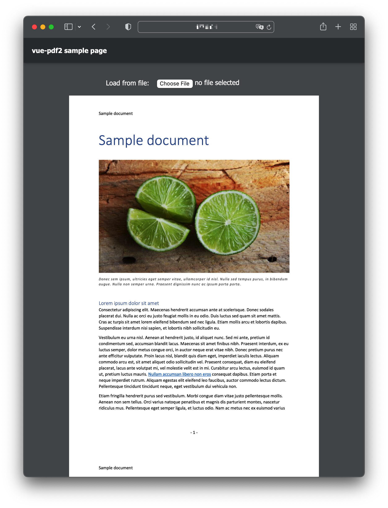

# vue-pdfjs2

Display PDFs in your Vue app as easily as if they were images.

## Compatibility

- `Vue < 2.7`

For `Vue 2.7+` / `Vue 3`, reference to branch [next](https://github.com/Mitscherlich/vue-pdfjs2/tree/next).

## Quick start

Install [`vue-pdfjs2`][vue-pdf2-npm] via [npm](https://npmjs.com) or [yarn](https://classic.yarnpkg.com).

```sh
$ npm install vue-pdfjs2 [--save]
# or yarn
$ yarn add vue-pdfjs2
```

## Screenshot (Preview)



Check it out in [example/](example)

## License

[MIT](LICENSE)

[vue-pdf2-npm]: https://www.npmjs.com/package/vue-pdfjs2
